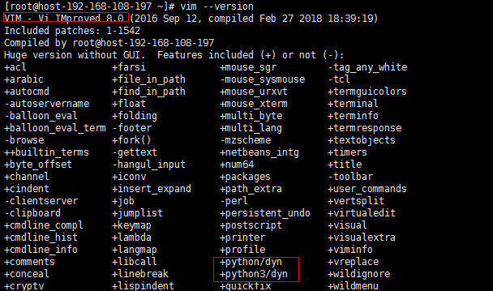
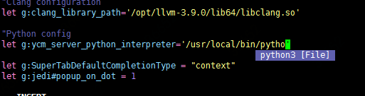
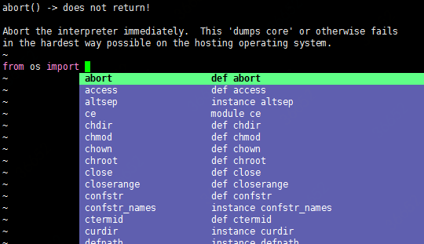
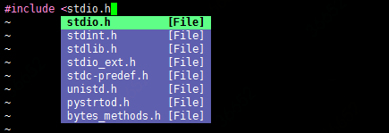

# Vim+YouCompleteMe插件安装

### **【系统环境】**

CentOS Linux release 7.2.1511 \(Core\)

### **【版本要求】**

a\) vim 版本是 7.4.143 或以上

b\) libclang 3.9或以上

### 【主要步骤】

#### 1、安装python3

    a\) 先添加yum repo, 放入/etc/yum.repos.d/ 路径下 



    b\) yum install python36.x86\_64

#### 2、重新编译安装vim，加入python支持

    a\) yum install ncurses-devel

    b\) wget [https://github.com/vim/vim/archive/master.zip](https://github.com/vim/vim/archive/master.zip)

    c\) unzip master.zip

    d\) cd vim-master/src/

    e\) ./configure --with-features=huge --enable-pythoninterp --with-python-config-dir=/usr/lib64/python2.7/config --enable-python3interp --with-python3-config-dir=/usr/local/python3/lib/python3.6/config-3.6m-x86\_64-linux-gnu --enable-multibyte --enable-cscope --prefix=/usr/local/vim/


同时加入python2和python3的支持，其中的--with-python-config-dir的具体路径需要在系统中确认一下


    f\)  make && make install

    g\) mv /usr/bin/vim /usr/bin/vim7

    h\) ln -s /usr/local/vim/bin/vim /usr/bin/vim

    安装完成后vim --version 查询



#### 3、安装libclang-3.9.0

    a\) yum install clang-3.9.0

#### 4、在.vimrc中添加YCM插件

    a\) 在~/.vimrc中添加：Bundle 'Valloric/YouCompleteMe'

    b\) 切换到命令模式运行：PluginInstall

    （安装完成后会生成~/.vim/bundle/YouCompleteMe 目录）

    具体配置可以参考这里  



#### 5、编译安装YCM

a\) $ mkdir ~/.ycm\_build

b\) $ cd ~/.ycm\_build

c\) cmake -G "Unix Makefiles" -DUSE\_PYTHON2=OFF -DPYTHON\_INCLUDE\_DIR=/usr/include/python3.6m -DPYTHON\_LIBRARY=/usr/lib64/[libpython3.6m.so](http://libpython3.6m.so/) -DEXTERNAL\_LIBCLANG\_PATH=/opt/llvm-3.9.0/lib64/[libclang.so](http://libclang.so/) . ~/.vim/bundle/YouCompleteMe/third\_party/ycmd/cpp


使用python3的库来链接，由于编译vim的时候加入了python2和3的支持，可以用2的库链接，也可以用3的库来链接，但只能选一个



Mac os用这个命令：cmake -G "Unix Makefiles" -DUSE\_PYTHON2=OFF -DPYTHON\_INCLUDE\_DIR=/usr/local/opt/python3/Frameworks/Python.framework/Versions/3.6/include/python3.6m -DPYTHON\_LIBRARY=/usr/local/opt/python3/Frameworks/Python.framework/Versions/3.6/lib/libpython3.6m.dylib -DEXTERNAL\_LIBCLANG\_PATH=/usr/local/opt/llvm\@3.9/lib/libclang.dylib . ~/.vim/bundle/YouCompleteMe/third\_party/ycmd/cpp


d\) 编译成功后构建ycm\_core: cmake --build . --target ycm\_core --config Releas

#### 6、复制 .ycm\_extra\_conf.py 文件

a\) $ cp ~/.vim/bundle/YouCompleteMe/third\_party/ycmd/examples/.ycm\_extra\_conf.py ~/.vim/


该文件中定义了YCM运行时用于提示的库代码路径, 如果在编辑C或Python文件的时候，补全提示中没有你想要的头文件或者Python的库文件，可以查看.ycm\_extra\_conf.py


#### 7、修改.vimrc设置

```text

let g:ycm_server_python_interpreter='/usr/local/bin/python3'  "因为YCM编译的时候是用python3的库链接的，需要指向python3的路径

let g:ycm_global_ycm_extra_conf='~/.vim/.ycm_extra_conf.py'
```

**使用效果如图：**

编辑文本文件的时候：



编辑python的时候：



编辑clang的时候：



