# 破解Burpsuite

“破解Burpsuite”这个名字取得有点大，实际逆向结果并没有完全突破Burpsuite的license限制\(具体原因下文说明\)，但实在想不到合适的名字，姑且用这个。

写本文的目的主要有两个：

1、分享和记录crack的一些思路和技巧

2、抛砖引玉，希望能跟更多人交流

> **注意：期望通过本文获得有关逆向和破解的黑科技的人，可能要让你们失望了。破解的过程实际是不断的假设-验证、不断试错的过程，充斥一次又一次的失望与挫败，相当乏味。**

### 一、相关知识

逆向过程中会涉及到JVM字节码、类加载机制、Debug技术原理等相关知识，具体参见下表：

| 知识点 | 说明 | 资料索引 |
| :--- | :--- | :--- |
| JVM字节码 | 文中会涉及一些字节码片段，了解一些字节码的基本知识更佳，但不用太深。 | [JVM字节码指令集](https://docs.oracle.com/javase/specs/jvms/se7/html/jvms-6.html#jvms-6.5.jsr) |
| Java类加载机制 | 主要是反编译过程涉及到一些类的修改和替换 |   |
| Debug相关原理及工具 | 混淆后的字节码由于去掉了行号和使用了Anti-debug技术，无法正常使用IDE的debug功能 | [JPDA体系概览](https://www.ibm.com/developerworks/cn/java/j-lo-jpda1/)[OmniscientDebugger](https://github.com/OmniscientDebugger/LewisOmniscientDebugger) |
| 字节码增强技术 | 文中涉及ASM的使用 | [ASM介绍](https://www.ibm.com/developerworks/cn/java/j-lo-asm30/) |

### 二、现状及问题

[Burpsuite](https://portswigger.net/burp) 这款渗透测试软件每年不定期会有一个破解版本放出，但是该破解版本放出的时间不确定，并且破解版的license只有1年的有效期。license到期后的提示如下：

如果修改系统时间，可以绕过license expired的检测，但是一旦恢复系统时间，运行中的Burpsuite会给出license expired的提示，并且在十多分钟后自动关闭，如下图：

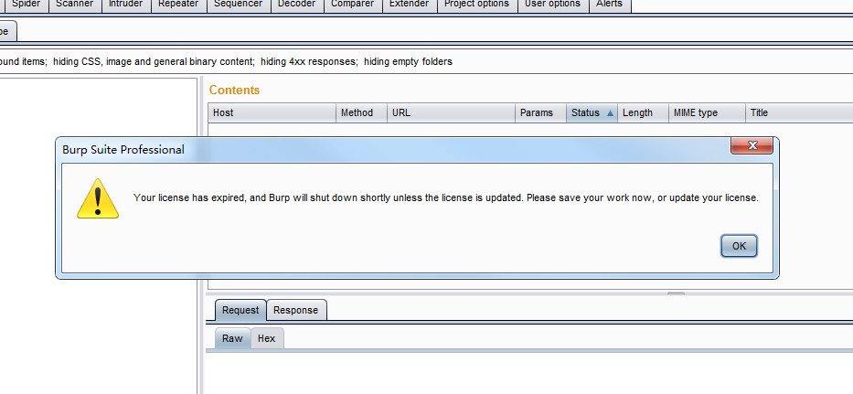

由于本人有段时间做渗透测试对Burpsuite的依赖比较大，就想尝试反编译一下源代码，看看能不能去掉这个时间限制，或者直接从根本上crack掉。现在看来当初的想法很幼稚T\_T

下面进入正题。

### 三、环境和版本

| 软件 | 版本 | 说明 |
| :--- | :--- | :--- |
| burpsuite\_pro | 1.7.03 | burpsuite专业版 |
| BurpLoader | 1.7.03 | 破解器 |
| JDK | 1.7.0\_80 |   |
| LewisOmniscientDebugger | 1.5 |   |
| Jad for Eclipse plugin | 2.10 |   |

目前网上流传的破解版，几乎都是通过BurpLoader这个破解器来启动Burpsuite。下面的反编译过程基于BurpLoader展开。这里列出版本主要是下文会涉及到一些反编译的代码，因为代码被混淆过，各个版本的类名都不一样。

### 四、BurpLoader如何做到的？

我们先从BurpLoader入手，看看人家是如何破解的。由于没有源码，在Eclipse中通过JAD打开 larry.lau.BurpLoader.class（ 这个破解器只有一个类）。打开后发现破解器本身居然被混淆过！

Jad反编译的结果并不理想，大部分代码都是混乱的，并且字符串也被编码。见截图：

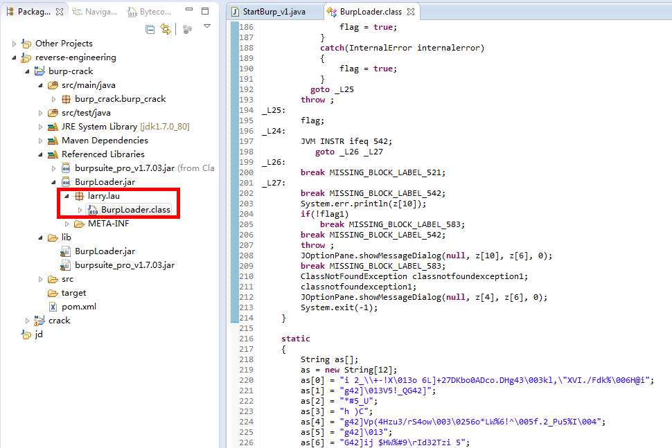

从直觉上看类文件在混淆的时候被打乱了逻辑，字符串也被编码过。目前已知的收费或开源混淆工具中，同时具有这两种功能的只有Zelix KlassMaster，见下图：

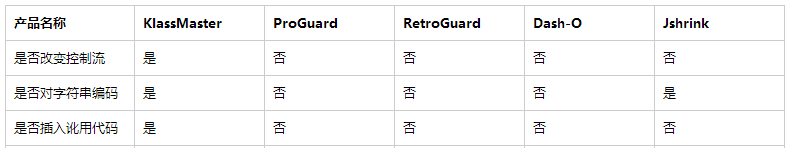

（随着后续反编译的深入，还会发现讹用代码的插入）

**那么现在问题有两个：**

1、如何解码字符串？

这里截图了混淆字符串的字节码片段加以说明：

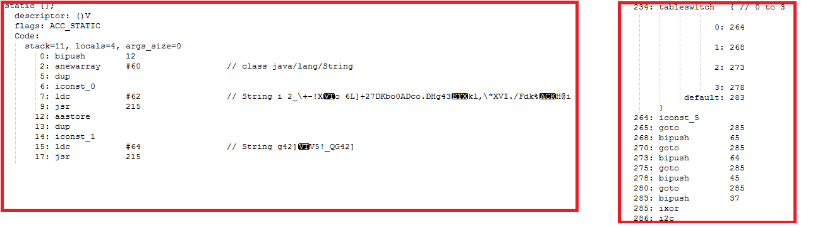

从上图中可以看到编码后的字符串常量（7: ldc）经过jsr指令跳转到偏移量为234处的switch指令，然后根据每条case分支与不同的整数（例如，bipush  65）进行异或，最后解码后的该字符串实际的内容。在了解字符串混淆编码的过程后，可以写一个简单的解码工具来逆向，但实际还有更简单的办法。因为是在static块中完成的解码操作，可以等类加载后通过反射获取实际的字符串内容。


这里有两个点可以注意下：jsr这个指令在1.7以后的JVM是看不到的（我也是只在KlassMaster混淆过的代码中才看到过这个指令）。jsr 这个指令只适用于1.6及以下的虚拟机，其作用是与ret指令一起完成finally block的跳转和返回，具体细节参见[Compiling finally](https://docs.oracle.com/javase/specs/jvms/se7/html/jvms-3.html#jvms-3.13)


2、如何修复BurpLoader类的正常逻辑？

这里没有捷径，只能肉眼反编译。反编译的完整代码看这里：



为了控制篇幅，这里不对反编译的过程展开，具体过程请跳转到这里查看_**反编译BurpLoader字节码\(待补充\)**_。

**成功反编译后我们来看下BurpLoader到底都做了些什么。**

1、设置UI外观：

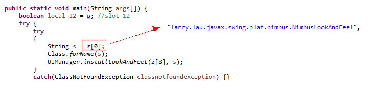

2、计算Burpsuite jar包的md5值是否与预期一致，否则弹出提出，终止程序：

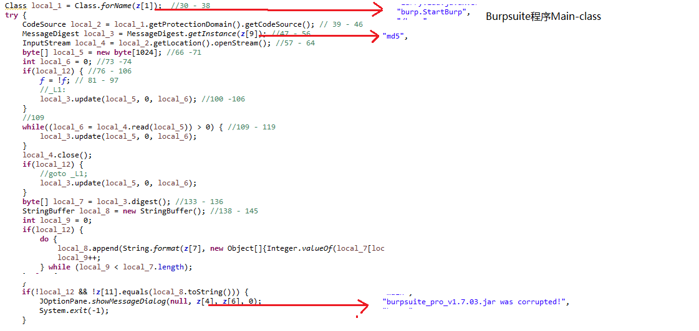

3、通过反射将Burpsuite中burp路径下对应的几个类的某个变量赋值，为固定key的计算做准备：

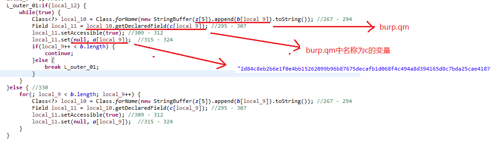


这里有点需要注意下：因为混淆后本地变量表被擦除，local\_12这个变量名是我随便取的。实际上这个变量是混淆工具加入的，目的是为了打乱程序逻辑。因为这段字节码无法还原成正常的代码，非要反编译的话只能通过label的方式来跳转，就像你现在看到的这样。实际这个变量恒为false。真正的分支是else中执行同样的逻辑。


4、设置程序的preference，即通常所说的首选项，这是Swing编程中常见的代码逻辑：

（正如你们看到的，这里又出现了local\_12）

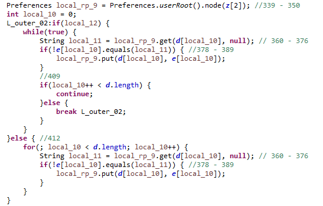

5、启动burp.StartBurp类

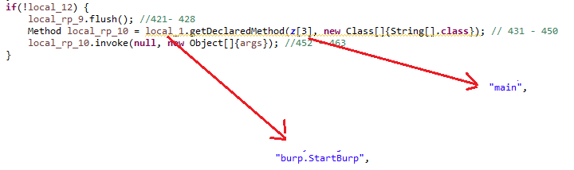

**BurpLoader的主体工作到此结束。这里最重要的对于固定key的计算，目前还不清楚BurpLoader的作者是如何定位到这几个类的？要知道整个burp包路径下被混淆的类一共有7168个！对， 你没看错。初步猜测通过diff运行前后的类镜像可以做到，但是这个工作量太大，暂时还无法开展。最主要的困境是如果按照这个思路去diff的话，结果发现不是就杯具了T\_T**

**但是不用担心，已经开了头，我们顺着StartBurp.class反编译下去，看能不能闯出另外一条路。**

### 五、从StartBurp开始顺藤摸瓜

既然BurpLoader已经被我们反编译出来，反编译的主要技术障碍已经扫清，再接再厉把StartBurp也拿下。因为后续需要不断的反编译文件，这里要在IDE中新建一个项目，目录结构如下：

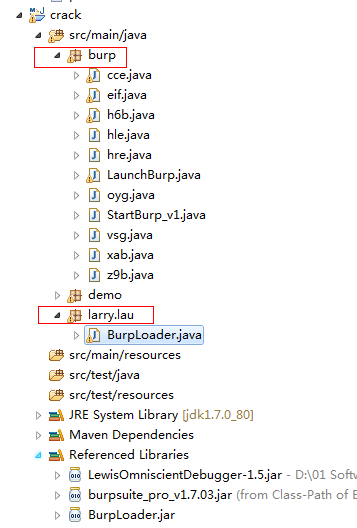

由于IDE中.classpath配置文件的原因，项目的包路径肯定先于依赖的Jar被加载，可以通过这种方式运行需要替换的类文件，并且debug。

StartBurp.class反编译后的文件查看这里：



StartBurp.java代码逻辑比较简单，虽然都是混淆过的变量名，因为可以Debug，可以很快定位到程序真正的主体逻辑是在**h6b**这个类里面，主要代码是这两行：

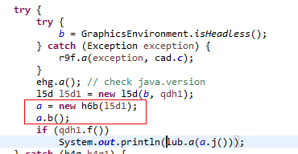

那接下来怎么办？对的，继续反编译**h6b.class,** 反编译后的代码查看这里：



通过反编译的代码加上Debug，如果熟悉Swing的编程的话，很快可以对**h6b.b\(\)**方法的逻辑内容整理一个大概出来，如下图：

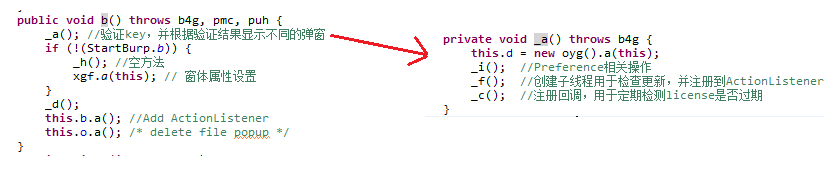

正如前面的所说，h6b.class才是核心逻辑所在，结论看似很清晰，其实是不断Debug，并且结合每次点击之后页面的响应推断出来的。不过总算有点进展，这里注意右图中的**oyg\(\).a\(\)**方法，我们继续顺着这条线走下去。


注意：**h6b.class**字节码中存在大量特征签名为 **b\(\)** 的方法，在Java语言层面，会被编译器识别为同一个方法，导致编译失败。但是在JVM中由于特征签名还包含了返回值和受查异常表，所有在编译器看来是非法的方法实际可能是可以共存的。此处也是混淆器的诡计之一。


**oyg.class**的反编译代码查看这里：



**oyg.class**的逻辑很简单，如图：

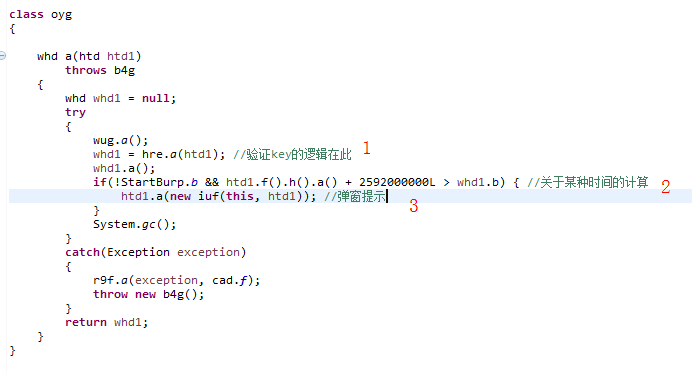

经过一番Debug和推测验证过后，**oyg.class**的主体逻辑已经被梳理出来。,暂且忽略标注1的代码（先不打开潘多拉的魔盒），这里我们先看标注2，这里计算时间的方式仿佛让我闻到了某种味道，2592000000毫秒正好等于30天！ 这不就是Burpsuite在license剩余时间不到30天的提示吗？！不急，我们看能不能Debug到这里看看弹窗的内容。

由于该破解版的license过期时间为2016-12-03，修改系统为2016-12-01，启动BurpLoader

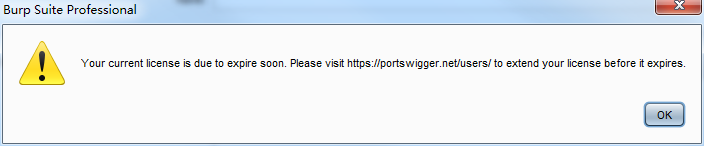

看来代码中**whd1**这个对象至关重要！！！在之前反编译的代码中这个对象也被引用多次。那我们把whd1对象的内容打印出来，看看都有些什么。

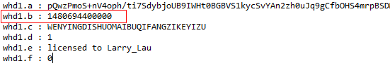

如果变量**whd1.b**就是破解版的过期时间，那在计算之前修改过期时间，看能不能绕过弹窗甚至license过期的限制。

这里就不再演示了，实际修改后确实能延长license的过期时间，并且恢复系统时间后Burpsuite也能够正常运行。


注意：这里替换oyg.class的时候需要一同替换BurpLoader.class，因为BurpLoader会计算程序Jar包的MD5值（前文有提到），替换完成后运行Jar包之前先修改系统时间到2016-12月之前，启动成功进入主界面后再恢复系统时间。


其实到这里我们的破解工作也基本结束，但细心的同学可能会问：上面提到的潘多拉魔盒呢？ 怎么回事？最主要的key验证过程都没破解啊？ OK，如果还有耐心，那我们进入下一节。

### 六、束手无策

回到**ogy.class**中标注1的地方，我们看看能不能故技重施，把key的验证反编译出来。先贴出**hre.class**的反编译代码：



闲话不多说，直接上图：

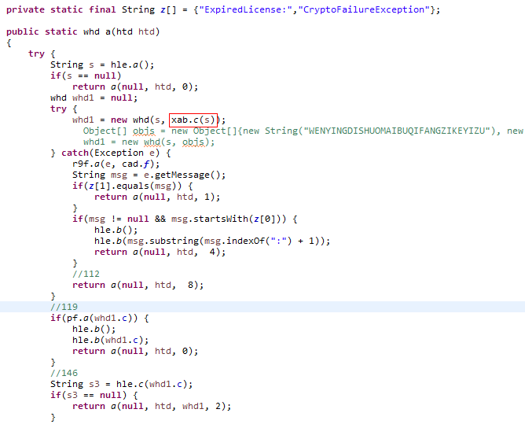

红色线框标注的部分**xab.c\(\)**是验证key的入口方法，catch和其他分支是根据计算结果弹出不同的弹窗。代码从**xab.c\(\)**开始就全部是反射调用，并且调用链长到令人发指的程度，并且整个调用链上的类或者方法被插入了大量无用的代码（见下面截图，就是前面提到的"**讹用代码插入"**），正常是写不出来这种license验证逻辑的，这里不得不服KlassMaster，就算暴露在你面前你也无从下手！

其实我当时走到这里是很不甘心的，继续尝试反编译了整个调用链上的前面3个类，实在走不下去了。并且由于混淆去掉了字节码的行号和Anti-debug的使用，导致一般的debug工具无法正常工作。有兴趣的同学可以试下，在反编译出来的代码中打断点，只要走到这里，会导致JVM退出（目前只是猜测在讹用代码插调用链上某处使用了Anti-debug），唯一的办法只能绕过**xab.c\(\)**的调用，mock一个返回对象，才能在反编译的代码中debug。

其实后来尝试了一些方法，比如：

1、因为key的验证结果最后也是返回一个**whd1**对象，直接略过**xab.c\(\)**的调用，手动生成一个合法的**whd1**对象。不行！最后会导致无法进入程序主界面，看来xab.c\(\)在计算过程中还set了一些变量值。

2、换一个debug工具试试，这里用了OnmiscientDebugger（一种基于日志时间戳的debug技术），看能不能查看整个调用链上的相关信息，因为是基于日志的，相当于保存了程序运行过程中各个时间段的镜像。我截个图你们感受下我当时的心情：

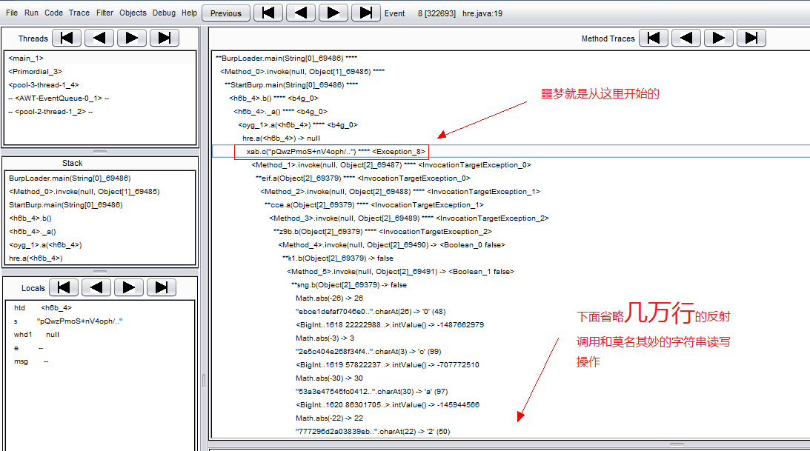

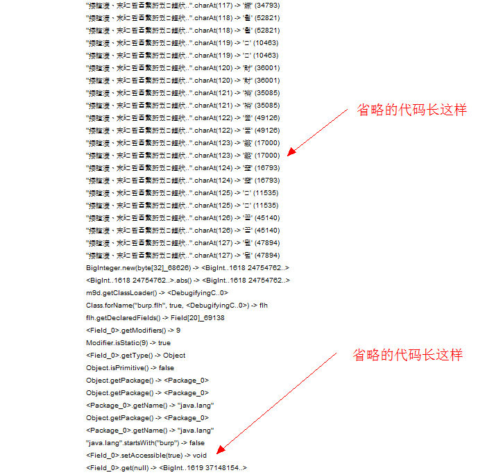

不过也并不是完全没有收获，从截图中的调用链底部开始分析，可以找到一些特殊的ActionListener类和文本的出处。可以记录下来以备后续使用。但目前看来，整个crack的工作暂告段落。

### 七、结尾

**其实整个crack过程非常枯燥，又受限于自身技术能力和经验，无法在当前完全突破license的限制。这里罗列一下主要的遗留问题和困境，望老司机指点。如果你也跟我一样对逆向和破解感兴趣，欢迎一起讨论和交流。**

a\) BurpLoader的作者是如何做到的？Diff程序注册前后的镜像？

b\) 因为从来没涉及过license相关的开发，对一般的license验证的实现方式几乎一无所知。

c\) 如何突破Anti-Debug？

d\) KlassMaster在插入讹用代码的时候判断标准是什么？

**附录：**

**反编译BurpLoader字节码举例（后续完善）**

[破解后的Burpsuite下载](https://pan.baidu.com/s/1qZrqNCw) **（仅供学习交流使用，切勿用于商业用途）**  

