# 线上MySQL死锁问题分析

## 一、问题及现状

并发调用服务端接口TemplateDataJsfService.updateTemplate\(\)导致数据库死锁。简化的并发场景如下：

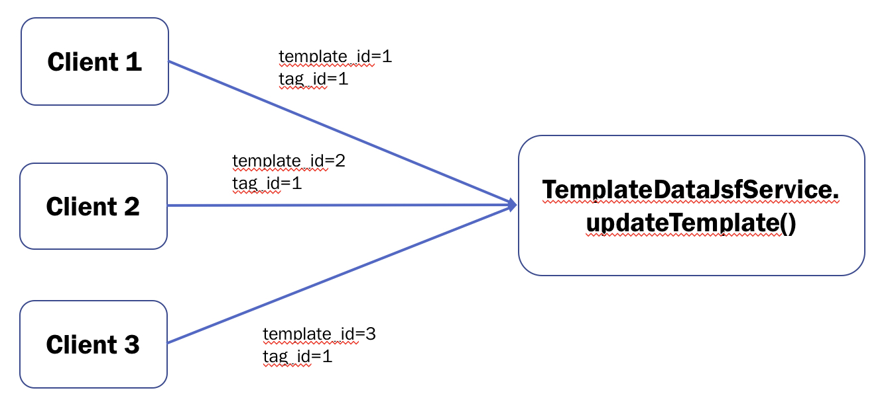

三个客户端不断调用updateTemplate方法，更新template\_id不同的模版。updateTemplate方法在更新模板实际内容之前会先更新template\_id与tag\_id的对应关系，该关系表为mid\_template\_tag\_relation，该表结构如下（为了方便叙述，做了简化）：

```text
CREATE TABLE `mid_template_tag_relation` ( 
    `id` int(11) NOT NULL AUTO_INCREMENT COMMENT "模板标识模板关系自增长id", 
    `tag_id` int(11) NOT NULL COMMENT "模板标识id", 
    `template_id` int(11) NOT NULL COMMENT "模板id", 
    PRIMARY KEY (`id`), 
    KEY `idx_template_tag_tag_id_index` (`tag_id`), 
    KEY `idx_template_tag_template_id_index` (`template_id`) 
) ENGINE=InnoDB AUTO_INCREMENT=125 DEFAULT CHARSET=utf8 COMMENT="模板标识-模板关系表"
```


更新mid\_template\_tag\_relation的方式是在一个事务中先delete，再insert：

1、delete from  mid\_template\_tag\_relation  where template\_id=236

2、insert into mid\_template\_tag\_relation \(id,tag\_id,template\_id,app\_type,gmt\_create,gmt\_modify\) VALUES\(null,1,236,null,'2018-04-17 09:56:53','2018-04-17 09:56:53'\)



并发调用过程中产生的死锁日志如下：

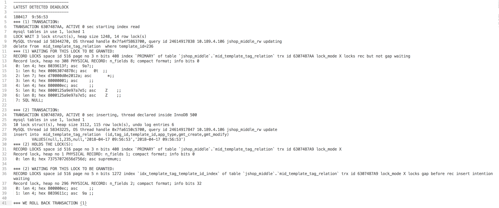


**日志说明**：

* Transaction 1的delete语句\(10行\)正在试图对关系表中主键索引\(12行，\)的某一行加锁，锁类型为**locks rec but not gap**，当前状态为等待\(waiting\)，因为该行已被Transaction 2加锁
* Transaction 2当前正在执行insert语句，目前持有一把锁\(30行\)，等待一把锁\(35行\)。持有的锁信息与Transaction 1正在等待的锁一致\(注意12行与31行的信息代表了锁的具体位置\)，等待加的锁类型为**insert intention**，该位置已被其他事务加锁，故等待。
* 由于Transaction 1权重较小，回滚Transaction 1\(41行\)。权重的判断主要基于两点：undo log 数量和启动时间。由于回滚开销加大，应尽量避免undo log数量较大的事务回滚；如果undo log数量相同，则比较启动时间。 


上图的日志说Transaction 2等待的锁被其他事务占有，是因为show engine innodb status日志只能记录最多两个事务，但死锁发生时可能不只两个事务，是更多事务形成的一个环，如下图：

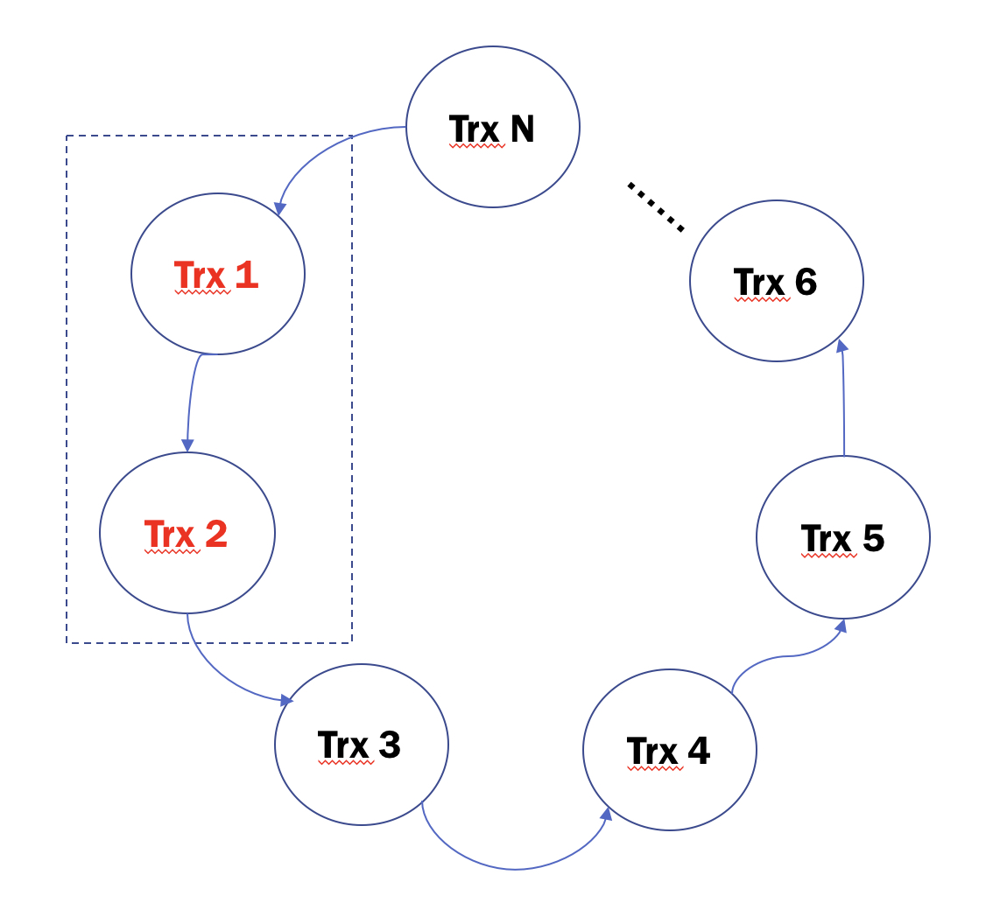

从日志信息上看，更类似这种情况，我们只看到了整个环的一部分。

## 二、问题分析

为了搞清楚多个事务中的delete和insert操作如何产生死锁的，需要先搞清楚几个关键概念：

* delete操作加什么锁？
* insert操作加什么锁？
* 不同锁之间的相容性

### 1、delete操作加锁

由于加锁类型与事务隔离级别和索引唯一性有关，这里假设事务隔离级别为RR\(REPEATABLE-READ, 与真实环境一致\)，表中template\_id为二级非唯一索引，其他组合情况这里不展开讨论。下文中对锁类型的说明都是基于此条件。

为了方便问题讨论，构造表数据如下：

mysql&gt; select \* from tag\_test;  
+-----+--------+-------------+  
\| id    \| tag\_id \| template\_id \|  
+-----+--------+-------------+  
\| 125 \|       1 \|              1 \|  
\| 126 \|       1 \|              2 \|  
\| 128 \|       1 \|              4 \|  
\| 135 \|       1 \|              4 \|  
\| 136 \|       1 \|              5 \|  
\| 137 \|       1 \|              6 \|  
\| 143 \|       1 \|              9 \|  
+-----+--------+-------------+  
7 rows in set \(0.00 sec\)

执行delete from  mid\_template\_tag\_relation  where template\_id=4 语句时加锁情况如下：

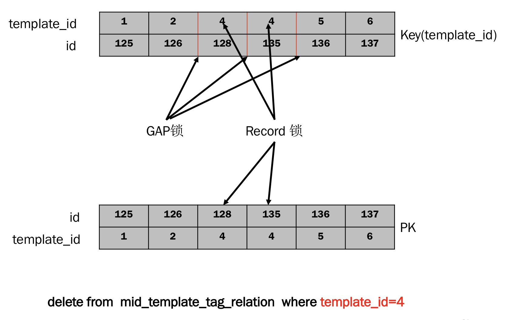

**加锁过程说明**：

* 先在二级索引上对template=4加行锁\(record lock\)，再在\(2, 5\)这个区间加间隙锁\(GAP\)。这两个锁组合起来叫**next key lock**。加行锁\(record lock\)很好理解，为什么要加GAP锁？ 简单来说就是因为在RR隔离级别下，为了防止幻读\([关于“幻读”看这里](https://dev.mysql.com/doc/refman/5.7/en/innodb-next-key-locking.html)\)，delete语句必须在行锁的基础上，再锁住\(2, 5\)这个区间，才能防止其他事务通过insert语句插入一个template\_id=4的记录。这里出现GAP锁有两个必要条件：1、RR； 2、索引非唯一。（其实这里还有一个隐含条件，就是delete的查询必须走索引，因为锁都是加在索引上的，如果全表扫描，则行锁会升级） 如果两个条件缺一，GAP锁就没有意义。假设二级索引是unique，delete语句只需要锁住template=4这一行就行了，其他事务进行insert时进行duplicate key check就能达到防止幻读的目的。 
* 再对主键加行锁\(record lock\)，主要是为了防止其他事务直接通过主键索引达到篡改数据对目的

下面在实验环境中验证delete锁类型，基于上文中对表数据，构造执行时序如下：

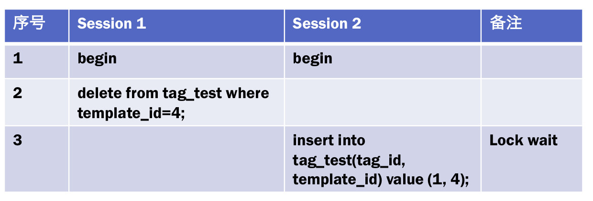

执行时查询锁信息如下：

select \* from information\_schema.INNODB\_TRX;

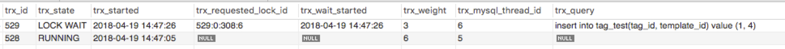

select \* from information\_schema.INNODB\_LOCKS; 

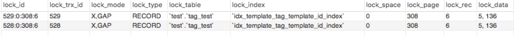


事务529（insert语句）等待获取锁，事务528（delete语句）加锁类型为X, GAP，即next key lock


### 2、insert操作加锁

insert操作加锁稍微有点不同，需要申请一种特殊的GAP锁，叫插入意向锁\(**Insert Intention Lock**\), 这种锁有个特点是，相互之间兼容，但与GAP锁不兼容。还是结合上文的表数据进行说明：


加锁过程说明：

* 先获取\(6, 9\)区间对间隙锁
* 插入成功后，对template\_id=7加锁

我的理解是因为在插入前，只需要通过GAP锁来表明插入范围和意图，所以叫插入意向锁\(**Insert Intention Lock**\)，属于X锁+GAP锁。（关于X、S、IX、IS锁先不展开，下文会对比说明）。为什么插入前不需要排他锁\(X锁\)呢？因为InnoDB为了并发效率，在并发插入时，并不通过排他锁\(X锁\)来互斥，而是在二级索引中通过duplicate key check来避免冲突（如果二级索引唯一），如果二级索引非唯一，那更不需要排他锁\(X锁\)。

下面对insert操作加锁类型进行验证，构造执行时序如下：

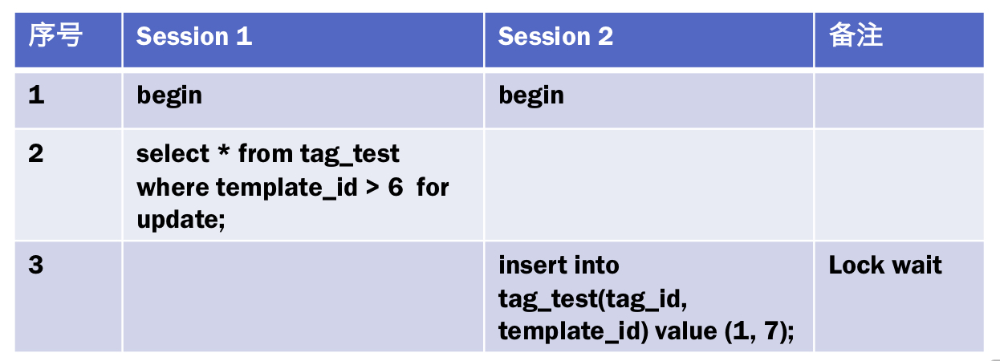

执行时查询锁信息如下：

select \* from information\_schema.INNODB\_LOCKS; 

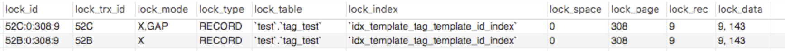


事务52C（insert操作）加锁类型为X, GAP（X锁为插入后需要对当前行加行锁）


### 3、不同锁之间对相容性

上文中提到的锁类型有：行锁\(Record Lock\)，间隙锁\(Gap Lock\)，Next-key Lock，插入意向锁\(Insert intention Lock\)，全都属于行级锁的一种，只是针对行锁的不同算法。实际上MySQL中还有表级锁\(IS, IX\)，他们大致关系和分类如下：

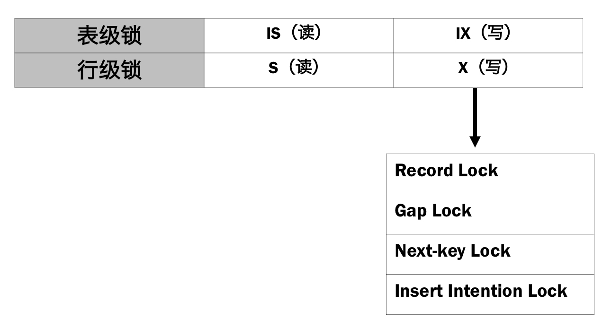

由于下文中重现死锁需要用到行级锁的相容性，这里先给出4种行锁的相容性矩阵：

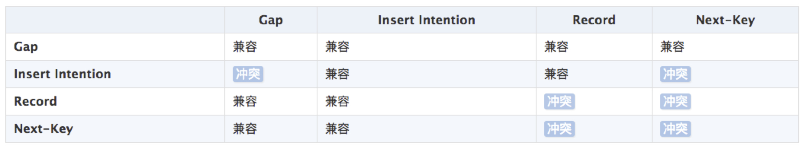

## 三、线上问题重现

回到正题，其实上面铺垫了这么多，就是为了能够重现死锁。同样基于上文中的表数据，构造执行时序如下：

mysql&gt; select \* from tag\_test;  
+-----+--------+-------------+  
\| id    \| tag\_id \| template\_id \|  
+-----+--------+-------------+  
\| 125 \|       1 \|              1 \|  
\| 126 \|       1 \|              2 \|  
\| 128 \|       1 \|              4 \|  
\| 135 \|       1 \|              4 \|  
\| 136 \|       1 \|              5 \|  
\| 137 \|       1 \|              6 \|  
\| 143 \|       1 \|              9 \|  
+-----+--------+-------------+  
7 rows in set \(0.00 sec\)

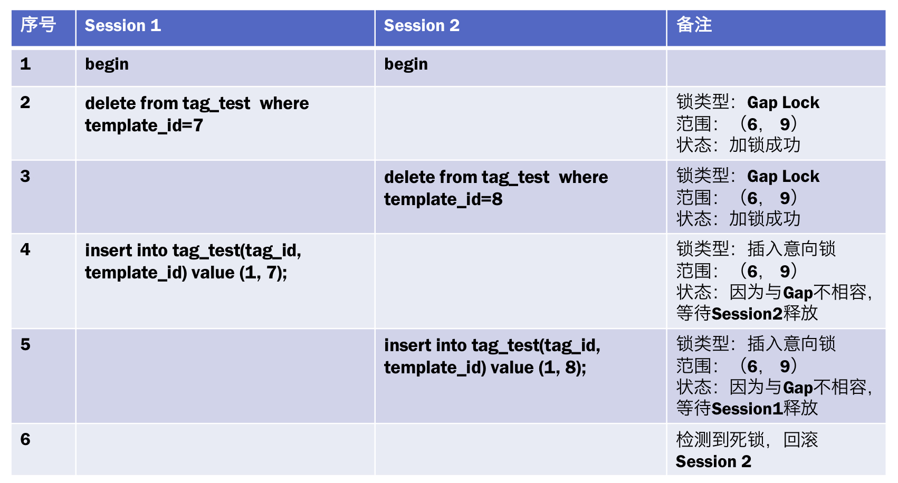

查询死锁日志：

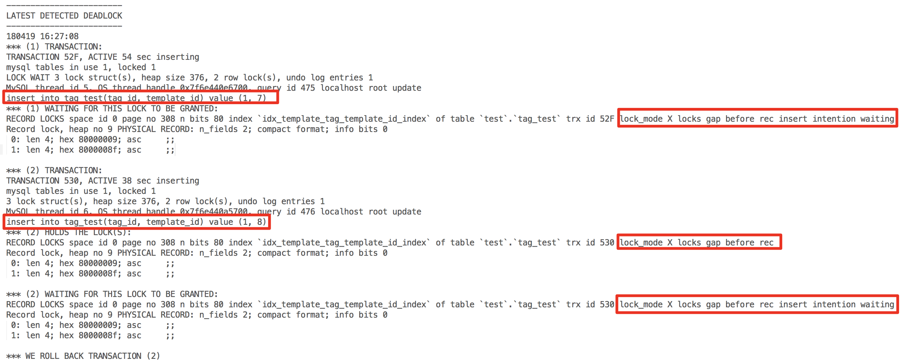


总结死锁发生的必要条件：一个事务中出现Gap锁和插入意向锁，并且该事务存在并发的场景。


虽然我们在测试环境重现了死锁，但线上死锁日志显示的信息要比我们分析的复杂的多，请注意线上日志第12行“index \`PRIMARY\` of table \`jshop\_middle\`”，日志显示的是死锁发生时的锁等待是在主键上！不是二级索引！再看第26行，Transaction 2总共持有115个行锁！

从目前已知的信息和代码层面暂时找不出引发主键锁冲突的代码或事务，但从压测的结果来看，线上死锁产生时有几个必要条件：

1. 并发线程数 &gt;= 3
2. 不同线程中的template\_id为相连整数，比如，234，235，236

线上死锁问题需要后续反复修改代码来测试验证。这里暂时不再深入讨论。

其实这种死锁比较典型，避免死锁的方法有几种：

1. 避免delete和insert放在一个事务中
2. 避免使用Gap Lock
3. delete之前先查询，如果有再insert（已经在线上环境验证，无效）
4. 使用主键进行delete操作

## 四、参考链接：

[http://hedengcheng.com/?p=771](http://hedengcheng.com/?p=771)

