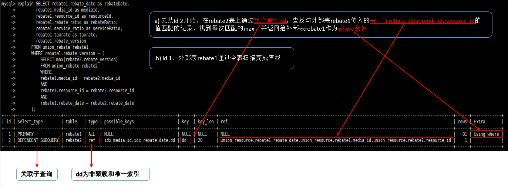
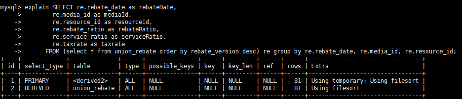
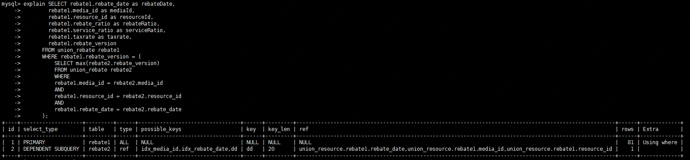
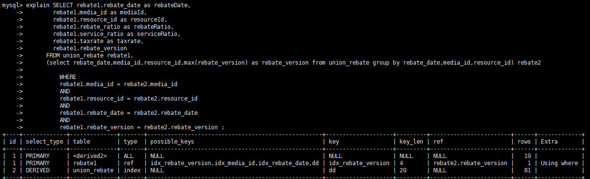
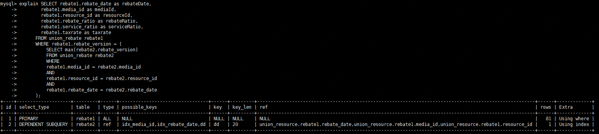
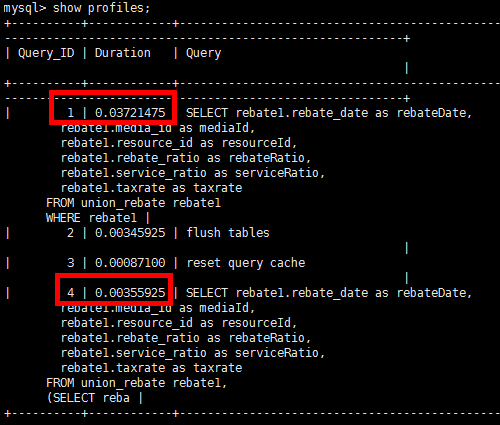
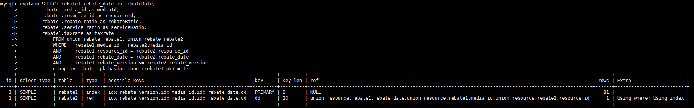

# 线上系统慢查询优化

### 一、线上环境存在慢查询如下： {#id-线上系统慢查询优化-一、线上环境存在慢查询如下：}

```text
SELECT rebate1.rebate_date as rebateDate, 
       rebate1.media_id as mediaId, 
       rebate1.resource_id as resourceId, 
       rebate1.rebate_ratio as rebateRatio, 
       rebate1.service_ratio as serviceRatio, 
       rebate1.taxrate as taxrate 
FROM union_rebate rebate1 
WHERE rebate1.rebate_version = ( 
      SELECT max(rebate2.rebate_version) 
      FROM union_rebate rebate2 
      WHERE rebate1.media_id = rebate2.media_id AND rebate1.resource_id = rebate2.resource_id AND rebate1.rebate_date = rebate2.rebate_date 
   );
```

该SQL执行计划如下：




**简要分析**：第一眼看上去发现的问题：子查询走了二级索引dd，但没有利用到覆盖索引；这种关联子查询外部查询不可避免会全表扫描；


下面进入具体分析。

### 二、问题分析 {#id-线上系统慢查询优化-二、问题分析}

#### **1、表结构和索引信息如下**： {#id-线上系统慢查询优化-1、表结构和索引信息如下：}



**说明**：字段rebate\_date, media\_id, resource\_id, rebate\_version可以确定唯一性，相同rebate\_date, media\_id, resource\_id组合下存在不同rebate\_version 

**查询目的**：查询相同rebate\_date, media\_id, resource\_id下最大rebate\_version所在行信息


#### **2、常用的此类查询方式：** {#id-线上系统慢查询优化-2、常用的此类查询方式：}

* **先按rebate\_version排序，再在派生表上group by**

```text
SELECT re.rebate_date as rebateDate, 
       re.media_id as mediaId, 
       re.resource_id as resourceId, 
       re.rebate_ratio as rebateRatio, 
       re.service_ratio as serviceRatio, 
       re.taxrate as taxrate 
FROM (select * from union_rebate order by rebate_version desc) re 
group by re.rebate_date, re.media_id, re.resource_id;
```

* **关联子查询，即本次慢SQL采用的方式** 


* **先用子查询生成派生表rebate2，再和rebate1连接**

```text
SELECT rebate1.rebate_date as rebateDate, 
       rebate1.media_id as mediaId, 
       rebate1.resource_id as resourceId, 
       rebate1.rebate_ratio as rebateRatio, 
       rebate1.service_ratio as serviceRatio, 
       rebate1.taxrate as taxrate, 
       rebate1.rebate_version 
FROM union_rebate rebate1, 
     (SELECT rebate_date,
             media_id,
             resource_id,
             max(rebate_version) AS rebate_version 
      FROM union_rebate 
      GROUP BY rebate_date,media_id,resource_id) rebate2 
WHERE rebate1.media_id = rebate2.media_id 
    AND rebate1.resource_id = rebate2.resource_id 
    AND rebate1.rebate_date = rebate2.rebate_date 
    AND rebate1.rebate_version = rebate2.rebate_version ;
```

#### **3、三种方式的执行计划如下：** 

* **对应上文第一种方式**




**释义**：

a\) 先从id 2开始，全表扫描排序后生成导出表derived2；          

b\) id 1在导出表基础上再次全表扫描，并最后group by。

**问题**：两次都using filesort（无法利用索引的有序性，需要额外排序）, 效率奇差


* **对应上文第二种方式**




**释义**： 

a\) 先从id 2开始，在rebate2表上通过组合索引dd，查找与外部表rebate1传入的每一行rebate\_date,medi\_id,resource\_id的值匹配的记录，找到每次匹配的max，并返回给外部表rebate1作为where条件            

b\) id1，外部表rebate1通过全表扫描完成查找

**问题**：关联子查询用到了索引dd，但由于Max的字段并不属于组合索引dd，无法通过覆盖索引一次性完成取值，需要回表然后取数据节点。


* **对应上文第三种方式**




**释义**：

a\) id2，独立子查询通过索引dd扫描rebate，生成派生表derived2    

b\) id1-1, 以derived2为驱动表，取rebate\_version字段作为连接表的查询输入值    

c\) id1-2，根据上文的rebate\_version值走rebate1的idx\_rebate\_version索引，完成查找（因为idx\_rebate\_version实际上单调递增，Cardinality值比dd高，故优化器选择了该索引，而不是dd索引）

**问题**：同样，步骤a\)中无法使用覆盖索引


### 三、解决问题 {#id-线上系统慢查询优化-三、解决问题}

#### **1、优化思路：** {#id-线上系统慢查询优化-1、优化思路：}

**把rebate\_version字段加入组合索引中，利用覆盖索引和松散索引扫描**

_`drop index dd on union_rebate;`_

_`alter table union_rebate add index dd (rebate_date,media_id,resource_id,rebate_version);`_

#### 2、**修改后第2、3种方式的执行计划如下：**

* **关联子查询方式**




释义：id 2 的extra字段表示该子查询每次通过索引节点即可一次性拿到所有数据，即覆盖索引 


* 先**派生后join的方式**



释义：id 2的type变为range，extra变为using index for group-by，即启用了松散索引扫描。        因为刚好满足松散索引扫描的条件：

1、group by 的内容是组合索引dd的最左前缀。

2、max的列rebate\_version属于dd


#### 3、**修改后两种方式的查询分析数据如下：** {#id-线上系统慢查询优化-3、修改后两种方式的查询分析数据如下：}

序号4为取消关联子查询，利用松散索引扫描的结果 



### 四、结论 {#id-线上系统慢查询优化-四、结论}

#### 解决方案： {#id-线上系统慢查询优化-解决方案：}

1. 修改union\_rebate的索引dd，把rebate\_version列加入组合索引

2. 修改查询，取消关联子查询，先由对子查询生成派生表，再进行连接，利用松散索引扫描

### 五、扩展 {#id-线上系统慢查询优化-五、扩展}

还有另外一种比较巧的查询方式： 

```text
SELECT rebate1.rebate_date as rebateDate, 
               rebate1.media_id as mediaId,  
               rebate1.resource_id as resourceId,       
               rebate1.rebate_ratio as rebateRatio,        
               rebate1.service_ratio as serviceRatio,        
               rebate1.taxrate as taxrate 
FROM union_rebate rebate1, union_rebate rebate2            
WHERE   rebate1.media_id = rebate2.media_id            
           AND     rebate1.resource_id = rebate2.resource_id     
           AND     rebate1.rebate_date = rebate2.rebate_date 
           AND     rebate1.rebate_version <= rebate2.rebate_version
GROUP BY 
rebate1.pk
HAVING COUNT(rebate1.pk) = 1;
```


注意最后一个AND和HAVING COUNT\(\)=1，只有rebate\_version为最大值的行才满足。


该查询的执行计划如下：



效率如何留给感兴趣的同学分析。

