# 模板市场JSF接口反序列化问题排查

## 一、问题

不知道是几天前了，开发同学在压测模版市场接口工程的时候发现其中一个接口的TPS异常的低，截图感受一下：

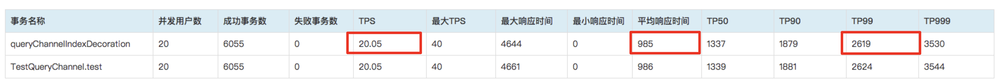

上图是压测端统计的数据，第一反应是先看下UMP中服务端的统计数据：

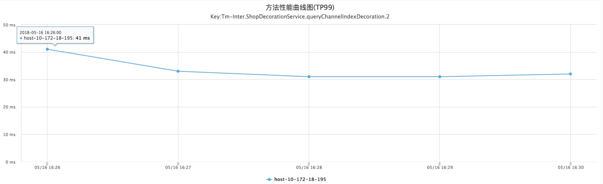

当时的压测环境是两台压测机\(4 core cpu\) 20个并发线程，一台被测服务器\(4 core cpu\)。虽然是单台服务器，但TPS确实太低了，而且TP99误差非常大！

压测过程中被测服务器的性能监控数据如下，为了对比，贴出理想情况下服务器的资源消耗截图（一个正常的JSF接口在20并发线程压测时的统计数据）：

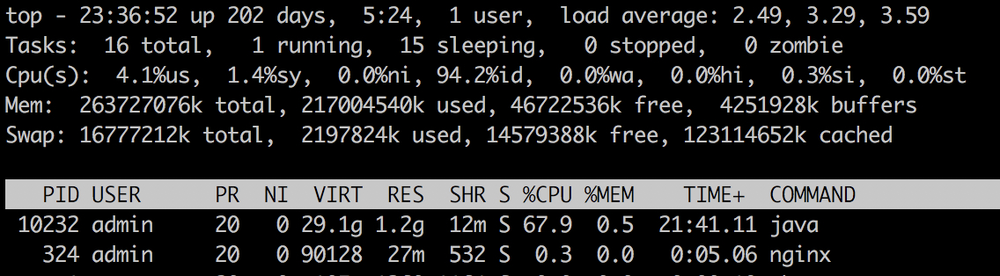



top命令释义

图3：由于是4 core cpu，折算一下实际利用率不到25%，MEM利用率忽略不计，平均负载 &lt; 4


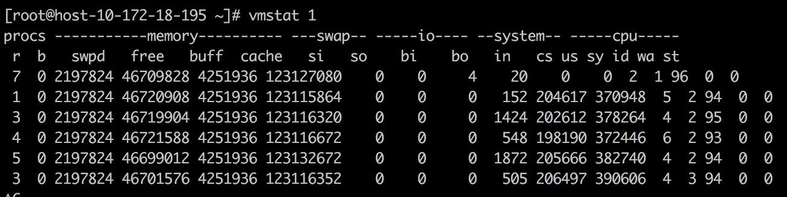

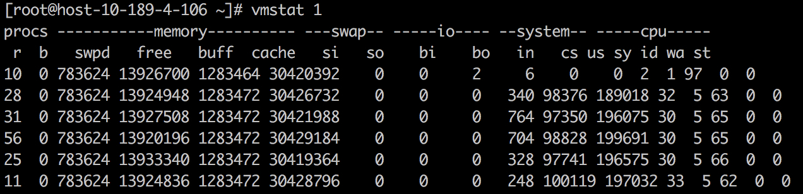


vmstat释义

图5：按1秒为刷新频率统计，运行中队列r &lt; 8, si和so表明没有内存swap，bi和bo说明IO几乎没有。注意上图输出结果第2列“b”，b = The number of processes in uninterruptible sleep. 即不可中断的阻塞队列数量。具体含义下文会提到


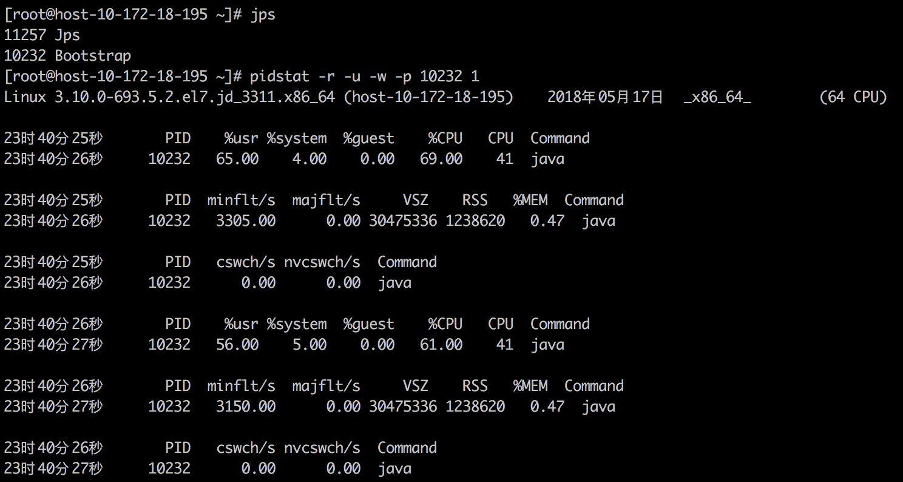


pidstat命令释义

查询Java进程的资源统计，按1秒为频率刷新。一般使用pidstat重点关注cswch/s这个指标，cswch=让步式上下文切换（对应Java线程的sleep、wait操作，还有Lock.park操作）。



cswch/s 为何等于0

这里要多说两句，cswch\(让步式上下文切换\)这个指标对于Java应用计算并发环境中的线程竞争度非常有用。但在目前我们大多数的虚拟机环境中，sysstat工具集（包括pidstat、mpstat和sar）中所有命令都无法针对单个进程统计cswch。具体原因目前还不清楚，但我印象中这个功能在Solaris中是正常的。 如果需要收集指定进程的context switch的频率，有个变通的方法，利用perf stat。如下：

\[root@host-10-172-18-195 ~\]\# jps  
12844 Jps  
10232 Bootstrap

\[root@host-10-172-18-195 ~\]\# perf stat -e task-clock,cs -p 10232 sleep 10

Performance counter stats for process id '10232':

595.602664 task-clock \# 0.060 CPUs utilized  
81,313 cs \# 0.137 M/sec

10.000809879 seconds time elapsed

上面命令的输出含义\(cs\)：进程10232在10秒内一共发生了81313次上下文切换\(cs\)，注意这里的cs是抢占式\(见pidstat截图中的nvcswch\)和让步式\(cswch\)的总和。

如果要在虚拟机中执行perf相关命令，请先获取到root权限。


命令的详细用法请自行google，这里可以得出的结论是服务器整体和Java进程的资源消耗很低，按照之前压测JSF接口的经验和数据，服务端如果20个JSF业务线程同时工作，CPU利用率这么低只有两个原因：

1、大量进程运行过程中被阻塞，并且阻塞时间还不短，这样才能让CPU的运行队列\(简称cfs\_rq\)大小维持在一个较低的水准（vmstat命令输出第一列r）。（这里涉及到一个知识点，请自行搜索“**CFS调度器原理**”。简单来说，Linux中对于CPU利用率的统计，是cfs\_rq中的所有进程运行时间的总和，这里不包括因为中断或者系统调用等原因陷入内核进而阻塞的进程，阻塞进程会暂时进入等待队列\(简称cfs\_bq\)，当阻塞条件达成时，才会由内核把阻塞进程放入cfs\_rq中进行调度。）

2、客户端请求频率太低。（其实第2点看似简单的原因在最开始并没想到，因为客户端的压测脚本实在太简单，想不到哪里会有问题）

为何TPS如此之低？客户端和服务端的数据统计误差如此之大？客户端多出来的2000+ms到底消耗在哪儿？这一切的背后到底是未知的神秘力量使然，还是代码问题所致？本期《走进科学》，哦不，《性能测试》将带你一步步抽丝剥茧，还原事实的真相。

## 二、分析思路

在进行问题分析前，先看下接口实现的代码：

```java
public RemoteResult<PageTemplateVO> queryChannelIndexDecoration(Long venderId, ShopFloorQuery query) {
 
        CallerInfo info = Profiler.registerInfo("xxxxxxxx"+query.getShopType(), "xxxxxxx", true, true);
 
        RemoteResult<PageTemplateVO> result = new RemoteResult<PageTemplateVO>();
 
        try {
 
            RemoteResult<ShopFloorQuery> queryResult = resetQueryValue(venderId, query); // pre-process and check args
 
            if (!queryResult.getSuccess()) { //return if check failed
 
                result.fail(queryResult.getMsg());
 
                return result;
 
            }
 
            query = queryResult.getData();
 
            String cacheKey = CacheKey.getPageInstanceCacheKey(query.getPageId(), query.getShopType());
 
            result = (RemoteResult<PageTemplateVO>)redisCacheClient.getObject(cacheKey); // get cached object from redis
 
            if (result!=null && result.getSuccess() && ShopTypeEnum.M_SHOP.getType().equals(query.getShopType())) {
 
                return result;
 
            }
 
            MgTmPageInstance pageInstance = mgTmPageInstanceDao.findOneByPageId(query.getPageId());
 
            if (pageInstance == null || StringUtils.isEmpty(pageInstance.getReleaseXmlContent())) {
 
                result.fail("no.page:" + venderId);
 
                return result;
 
            }
 
            String  xmlContent = pageInstance.getReleaseXmlContent();
 
            RenderContext context = new RenderContext(ShopTypeEnum.toEnum(query.getShopType()), RenderTypeEnum.MOBILE);
 
            context.setPageId(query.getPageId());
 
            context.setVenderId(venderId);
 
            context.setAppType(query.getAppType());
 
            context.setShopType(ShopTypeEnum.toEnum(query.getShopType()));
 
            context.setContextMap(query.getParamMap());
 
            PageContext pageContext = new PageContext();
 
            result = renderDataService.renderModule(context, pageContext, xmlContent, query.getProjectId()); // query object from DB and do rendering business
 
            if (result!=null && result.getSuccess()) { // cache queried object
 
                redisCacheClient.setObject(cacheKey, result, CacheTime.ONE_HOUR);
 
            }
 
        } catch (Exception e) {
 
            // TODO: handle exception
 
            LOGGER.error("ShopDecorationService.queryChannelIndexDecoration.Exception", e);
 
            result.fail("getIndexDecoration.Exception");
 
            Profiler.functionError(info);
 
        } finally {
 
            Profiler.registerInfoEnd(info);
 
        }
 
        return result;
 
    }
```

代码逻辑比较简单，为了便于理解主干部分已添加了注释。因为压测脚本中都是相同参数，除了第一次请求外，后续请求都是命中都redis，从UMP中都统计来看，单次请求的响应都在40ms以内。除非UMP的使用方法错了，或者UMP统计出错了。对于这个问题，通过在代码中手动打印时间已经在第一时间排除了是UMP的问题。

在进一步分析前我们先把问题简化一下，把压测端20个线程减少为1个线程，先排除服务器线程池的问题。单线程请求的数据如下（压测端统计）：

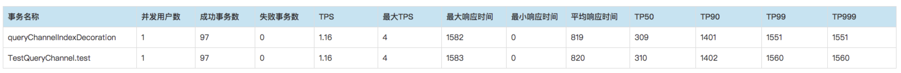

OK，问题依然存在，剩下的工作就是尽量找出可疑因素，然后逐个假设-验证-排除。

那另外一种可能就是consumer和provider之间的网络不稳定，导致丢包和重传，可以在服务器和客户端同时抓包看看（这里涉及一个知识点，抓包最好在客户端和服务器同时进行，是因为真实网络环境的SYN和ACK的交互并不是理想中的严格顺序对应的，而是相互交错的，如果只在一端抓包，很容易被乱序的报文搞晕，不过这里也可以自行脑补一下，在本文这种情况下，应该着重分析哪一端的TCP重传报文），但由于测试环境的压测端并不受我们控制，实际过程中并没有抓包来分析，而是采用了变通的方式：修改接口返回对象的实际内容，通过改变报文大小来确认是否存在网络问题。

先分析一下接口返回对象的实际内容，返回对象用JSON序列化后大概长这样：

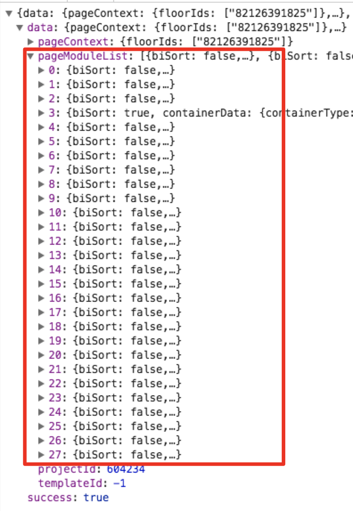

修改数据库把pageModuleList的长度控制在5，压测数据如下：

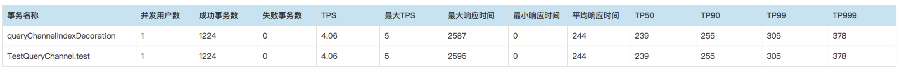

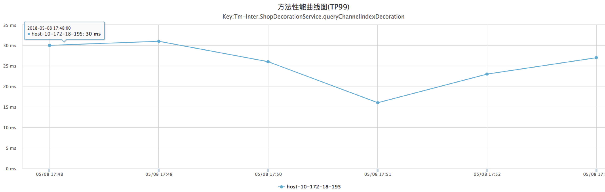

在其他条件都不变的情况下，TPS提高了4倍，TP99的误差缩小了近1200ms，服务端的TP99和之前区别不大，继续维持在40ms以内。\(实际到这里也间接证明了存在网络问题的可能性比较低，虽然证明方法不严谨\)

拿到这个结果后自然想到了问题有可能出在接口返回对象的序列化/反序列化过程中，然后查看JSF的文档，梳理了一下通过JSF进行远程调用时的核心过程大致如下（provider端）：

1、通过socket接收到consumer的数据包，进行decode，并且做一些权限校验

2、通过代理调用实际接口实例的方法

3、对方法返回对象进行post-process操作，最后通过Channel.writeAndFlush\(\)方法进行异步写socket

（这里暂时只列出过程，具体的代码下文会提到）

UMP中方法耗时统计实际上只包含了第2步，如果序列化的假设成立，那问题应该出在第3步。但如果要自己做计时的话，还有点麻烦，如非逼不得已，先不走这步棋。

因为修改返回对象的实际内容后\(缩小List大小\)TPS和响应延迟有了明显改善，这里想到了把返回对象从泛型改成Object试试，即 RemoteResult&lt;PageTemplateVO&gt; =&gt; RemoteResult&lt;Object&gt;。然后修改数据库恢复List长度为27，测试数据如下：

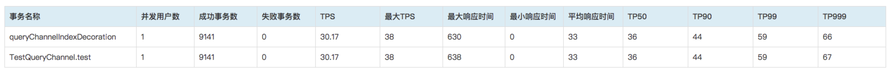


测试说明

这里恢复返回对象的实际内容List长度为之前的值27，是基于性能测试的一个基本原则：每次修改范围尽量控制在最小，然后测试-对比。


拿到这个测试结果后感觉事情开始明朗了起来，问题很有可能出现在序列化/反序列化过程中，但这里是两个过程，即服务端序列化对象、客户端反序列化对象。但由于客户端环境不受我们控制，无法进行资源监控和统计JVM运行时数据，所以还是只能在服务器端更深入的进行调查。这里利用[Java Flight Recorder](https://www.ibm.com/developerworks/cn/java/j-lo-performance-analysissy-tools3/)抓取JVM的运行时日志看看有没有收获。

JFR的具体配置参见这里：[这里](../java/gong-ju-jing-yan.md)


现场日志由于信息安全原因，无法提供


由于日志信息包含JVM的很多方面，内容太多，这里只截图关键内容进行说明，前图为修改前，后图为修改后：

1、JSF业务线程的采样统计：

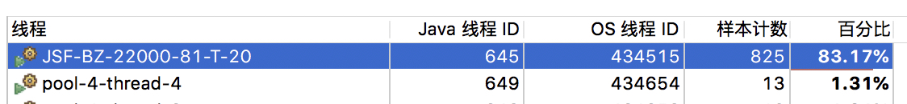



JSF业务线程统计说明

上图为JSF业务线程5分钟的采样统计，因为压测端是单线程，所以服务端采样占比最高的只有一个JSF-BZ线程。可以看到左侧截图中业务线程的“样本计数”非常少，5分钟之内只采样了825次。

这种情况一般是因为BZ线程执行过程中有某个操作导致阻塞，被内核从运行队列移动到阻塞队列\(回顾一下上一节中对CPU利用率低的分析\)，不参与进程调度，当然计数就会变少。


2、JSF业务线程中热点方法采样统计：

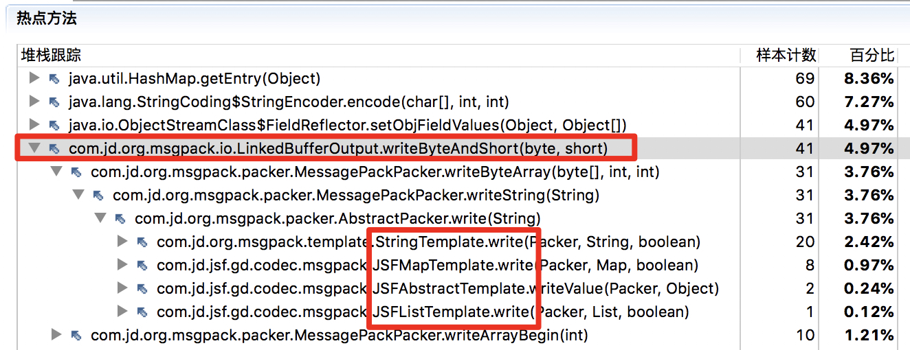



JSF业务线程热点方法统计说明

上图是业务线程JSF-BZ中的热点方法采样统计。因为JSF的默认序列化方式为“msgpack”，这里初步判断红框部分是JSF调用Netty的Channel.writeAndFlush\(\)方法写数据时底层的序列化方法\(并未看过源码\)，两个截图明显的区别是：

图14方法的百分比明显高于图15，并且图14中LinkedBufferOutput.writeByteAndShort\(\)的调用是由上层4个Caller调用累计的结果，图15只有2个。

（关于什么是Channel.writeAndFlush\(\)，下文会提到）


3、Jstack dump

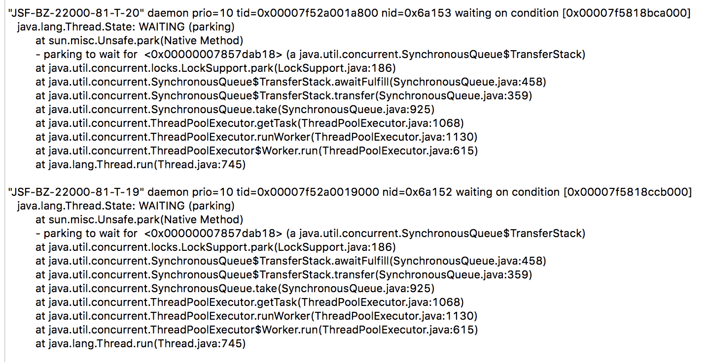

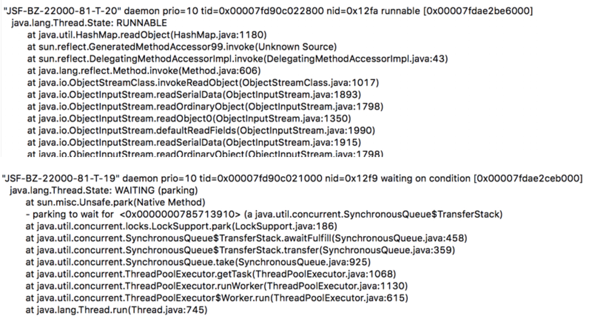


Jstack dump信息说明

上图是单线程压测中服务端的Java 线程转储。多次截取后按CPU占用Top 10 排序的前2项。这两张图是重点，分析前先交代下背景：

1、JSF业务线程池默认是采用的同步队列SynchronousQueue，队列深度为0，即如果从中take的时候队列为空，则一直等待直到队列被其他线程put进一个对象。反之，put的时候也一样，如果队列不为空，则等待直到其他线程take

2、JSF业务线程池coreSize = 20，截图下面还省略了其他业务线程的信息

3、可以看到底层通过LockSupport.park操作进行阻塞等待，这涉及到对AbstractQueuedSynchronizer\(简称AQS\)对理解，限于篇幅不在这里展开。但建议看到这里的同学先自行补充一下这个知识点，便于下文的理解。该方法的特性大致如下：

a\) 默认非公平

b\) 基于CLH队列算法的改造，在此基础上，先进行CAS尝试获取，如果失败则进入“可中断阻塞状态”放入改造后的CLH队列中（注意和上文中介绍vmstat命令时的“不可中断阻塞状态\(uninterruptible sleep\)”区分开，这里也回答了上文中vmstat输出第2列为何等于0的原因，因为Java中线程因为互斥进入阻塞状态，由于底层API的原因，大部分都是可中断状态。那有没有API是进入不可中断阻塞的？）

**结合背景知识，这里结论其实很明显了：**

1、左侧业务线程由于在SynchronousQueue取不到任务，而一直处于Waiting on condition状态，condition就是其他线程把任务put进队列。

2、右侧业务线程由于take到了任务，大部分时间都处于Runnable状态。

等等！上文不是说了CPU占用率统计只是针对运行队列吗？如果业务线程都处于阻塞了，为啥Jstack还要把算成是CPU占用率的Top 1呢？那业务线程目前这种状态到底算不算占用CPU呢？

其实这个问题主要是由两个原因造成的：1、LockSupport.park方法的实现，上面已经说了，CAS操作引起的CPU占用；2、内核对进程状态的管理并不是直接从可运行状态到阻塞状态，中间还有个过渡态叫TASK\_PARKED，但具体这部分时间会不会被统计到占用率中，我目前也不清楚。如果有老司机，请给我扫个盲。关于第2点可以自行搜索“linux task\_parked”。


## 三、测试验证

OK，经过上文的分析，问题进行到这里貌似必须走那步“逼不得已”的棋了：进行服务端方法调用的完整计时。因为码字确实很累，下面的内容我尽量简单一点。

因为JSF目前看不到源码，只有利用反编译工具，下图为JD-core反编译结果：

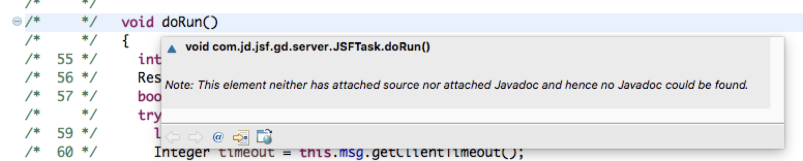


JSFTask.doRun说明

JSF业务线程run\(\)方法的核心Callee方法，里面的代码逻辑正如[上文中](https://cf.jd.com/pages/viewpage.action?pageId=107888319#id-%E6%A8%A1%E6%9D%BF%E5%B8%82%E5%9C%BAJSF%E6%8E%A5%E5%8F%A3%E5%8F%8D%E5%BA%8F%E5%88%97%E5%8C%96%E9%97%AE%E9%A2%98%E6%8E%92%E6%9F%A5-jsftask-dorun)描述的一样


通过ASM修改doRun\(\)方法字节码，添加计时统计输出到日志中。添加的字节码翻译成Java代码如下：

```java
void doRun()
 
   {
 
     int responseSize = 0;
 
     ResponseMessage responseMessage = null;
 
     boolean isBizException = false;
 
     try {
       long now = JSFContext.systemClock.now();
 
       //pre-process and check， omitted
 
 
 
       final long beforeInvocation = -now + (now = JSFContext.systemClock.now());
 
 
       responseMessage = invoker.invoke(this.msg); // invoke real interface impl
 
 
       final long invocationing = -now + (now = JSFContext.systemClock.now());
 
       final long fnow = now;
 
  
 
       //post-process and check , omitted
  
 
       if (serverRingBufferHolder != null)
 
       {
 
 
       } else {
 
         Future future1 = this.channel.writeAndFlush(responseMessage);
 
         future1.addListener(new FutureListener()
 
         {
 
           public void operationComplete(Future future) throws Exception {
 
             if (future.isSuccess()) {
 
                 long afterInvocation = JSFContext.systemClock.now() - fnow;
 
                 logger.info("");
 
               if (logger.isTraceEnabled()) {
 
                 logger.trace("", Boolean.valueOf(future.isSuccess()));
 
               }
 
               return; }
 
             if (!(future.isSuccess())) {
 
               Throwable throwable = future.cause();
 
               logger.error("", throwable);
 
             }
 
           }
 
         });
 
       }
```


代码说明

分三段计时：实际方法调用前、实际方法调用、实际方法调用后。注意第57 行，因为最后是异步writeAndFlush操作，这里要注意下log打印到回调方法里面。确保数据已经被刷到socket当中再打日志。

其实也可以不用修改字节码，基于反编译的代码创建一个完全相同的JSFTask.class文件也可以，但基于反编译代码修改的时候需要注意一点，如图：

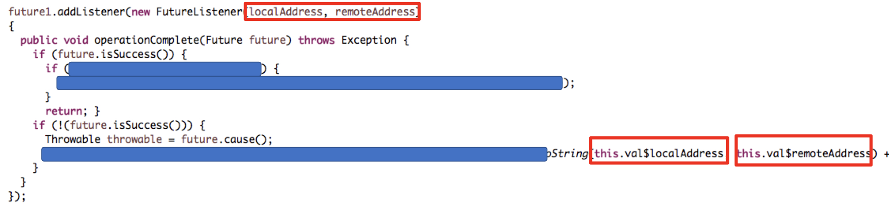

反编译由于不够“聪明”，翻译出来一个Netty中不存在的FutureListener的构造方法，这里是因为匿名内部类的字节码表示方式的原因，实际上localAddress是外部final变量。具体细节可以自己写个匿名内部类试试就明白了。这里也引申出一个比较有趣的问题：Java匿名内部类中引用外部变量为何要声明为final？


下面用修改的class替换jsf-1.6.5.jar中的JSFTask.class后，还是基于单线程客户端的情况进行压测，拿到服务端日志如下：

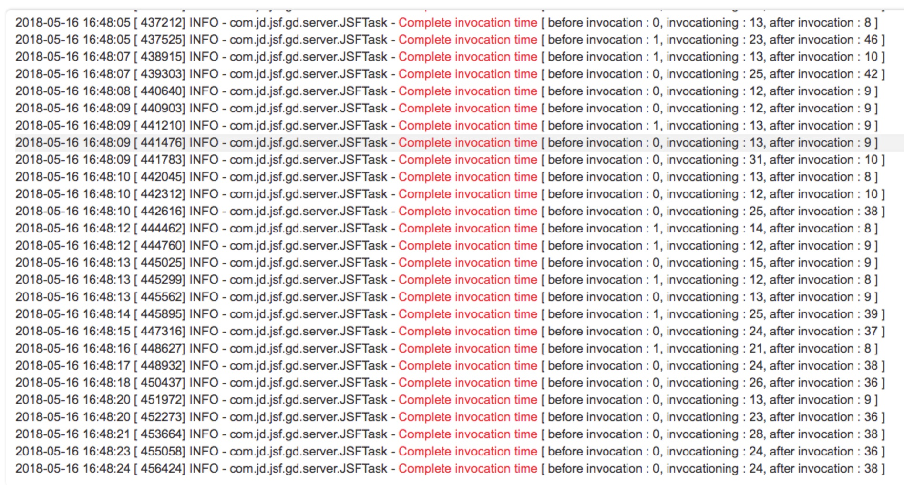

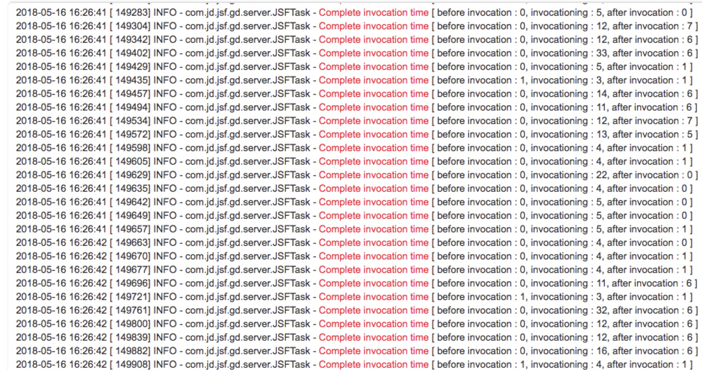


方法计时统计

图19返回对象：RemoteResult&lt;PageTemplateVO&gt;

图20返回对象：RemoteResult&lt;Object&gt;

上图中修改前后服务端序列化的耗时差距并不足以解释UMP和客户端的巨大误差，那答案只剩下一个，问题出在客户端反序列化！


然后检查了客户端的JSF版本，发现是1.6.0，先替换为1.6.5，然后在客户端校验运行一下，拿到日志如下：

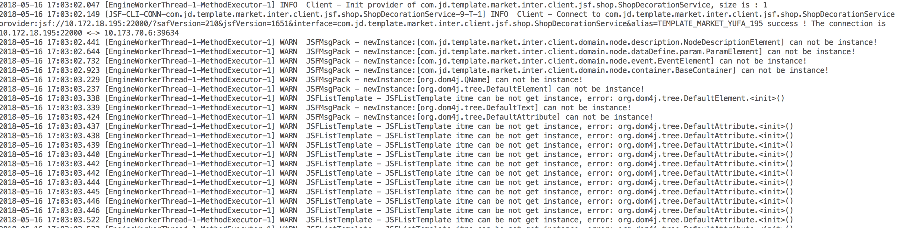


日志信息说明

之前因为客户端版本不匹配，校验执行的时候只打印了4行WARN日志，排查过程中就被忽略了。客户端更换成最新版本后，问题一下就暴露出来了，反序列化过程中因为实例化失败抛出大量异常所致。

这个问题在之前分析中台数据库死锁问题也有讲到，异常处理不好，对性能来说是毁灭性的打击。


最后，查了一下JSF的文档，如果接口返回对象包含泛型，需要在客户端配置serialization=“hessian”，默认的“msgpack”方式不支持泛型。修改客户端jsf-consumer.xml配置后，单线程测试数据如下：

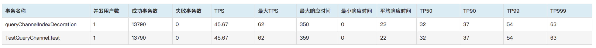

Game over.

## 四、总结

性能测试比较麻烦的一点就是排查问题或者瓶颈的时候如果干扰因素太多，需要对每个因素进行 假设-验证-排除这个过程，最终把目标缩小到可定位出问题的范围。只是这个过程的快慢，取决于个人经验和能力，但基本过程都是一样的。  
此次性能问题的排查也是遵循了这个过程，大致总结如下：

**1、简化问题：**

多线程环境简化为单线程压测，先排除线程池的因素干扰。

第一时间获取服务器监控数据，排除资源瓶颈。

**2、尽可能找出可疑因素 （依赖经验和对业务理解）**

UMP统计错误、网络问题、GC、脚本编写错误、服务器版本太低，业务代码问题

**3、从第2步中逐个选取因素进行“假设-验证-排除” （依赖技术能力）**


敲黑板

其实对于任何问题的求解，都有一个万能方法，就是“穷举”，性能测试尤其如此。


终于写完，写这篇分享过程中有个直观感受就是很难聚焦。一是因为性能测试包含范围太庞杂，二是因为一次具体问题定位过程中的涉及的技术细节太多，很难在一篇分享中把所有细节讲清楚。那如何做取舍，又是个问题。

时间仓促，文中肯定避免不了有纰漏甚至错误的地方，如果有同学发现了，不要犹豫，不要客气，请斧正！  


