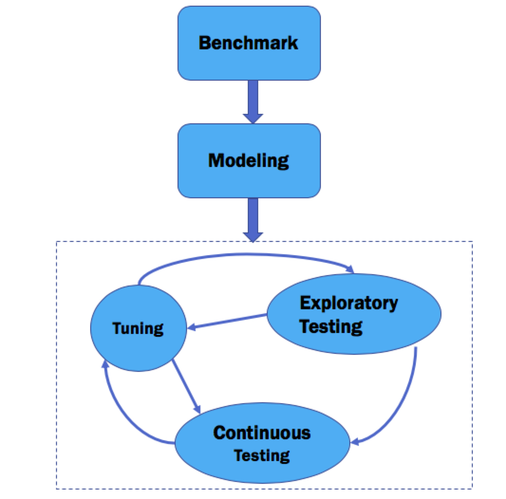

# 性能测试路图

## 性能测试目的

理解被测应用的运行特点，通过技术手段使其尽可能的利用系统资源以提供更大的吞吐量和更短的响应延迟

关键词：应用特点、技术手段、资源利用

#### 如何了解应用的运行特点？（Java）

1、方法调用的CPU占用率分布：

lightweight-java-profiler + flame-graph，JMC

2、并发对同步资源的竞争程度：

%cswch， jstack

3、对缓存系统的利用：

memperf，perf

4、GC效率：吞吐量和延迟••JIT优化分析：hsdis + JITWatch

####  有哪些技术手段

1、应用程序调优：

编写GC友好和JIT友好的代码、局部性原理、指令流水线 

2、中间件调优：

线程池，GC，Code cache size

3、数据库调优：

配置（Percona toolkit）、慢SQL、锁等待

4、文件系统调优：••操作系统调优：

## 工作流

#### Benchmark

**基础架构的benchmark测试，作为短板快速排查和代码优化数据依据。主要包括硬件资源和基础部件**：

1、Linux：memory mountain、磁盘IO效率、网络IO效率、文件系统读写效率（IO效率测试过程中对块大小对设定可以参考业务压测时产生的平均块大小：avgrq-s）

2、数据库：根据业务压测中的高频数据来测量读写的吞度量和延迟，需要注意线程池的大小和flush redo log的方式（大量写的场景）

3、…….

#### Modeling

测试场景建模：

1、根据被测系统硬件信息建模，确定压力机的并发线程数和服务器的服务线程池（Tomcat、JSF、JDBC）大小；

2、测试场景建模：单一场景的代表性、混合场景的合理性。

#### Exploratory Testing

主要关注在一定压力下系统的抖动情况，两个方面：

1、系统资源占用情况：Cpu load、swap、%cswch

2、Java应用程序：GC效率

试探性测试主要目的是不断调整压力数量，来观察系统的吞吐量和延迟的变化，在这个过程中需要对系统资源各个指标都做到心中有数，当短板出现时能够快速定位。最终确定应用在各个单一场景下的最佳线程池大小。

#### Continuous Testing

稳定性压测：

在稳定的压力量下进行资源监控和数据分析，核心思路是最大化的压榨服务器资源，这里主要是指CPU的计算资源，避免在CPU资源得到最大化利用前出现系统短板。

#### Tuning

1、中间件

包括：RPC（JSF）、JVM、……

优化点：线程池、GC、JIT

2、数据库

包括：MySQL

优化点：配置、慢SQL、锁等待

3、代码优化

包括：更优的算法、更优的写法、锁竞争

优化点：编写GC友好和JIT友好的代码、局部性原理、指令流水线


更优的写法：顺序 -&gt; 异步

锁竞争：jstack dump分析

JIT优化分析：inlining，loop unrolling


