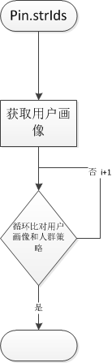
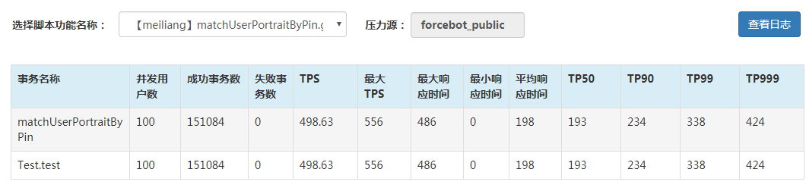
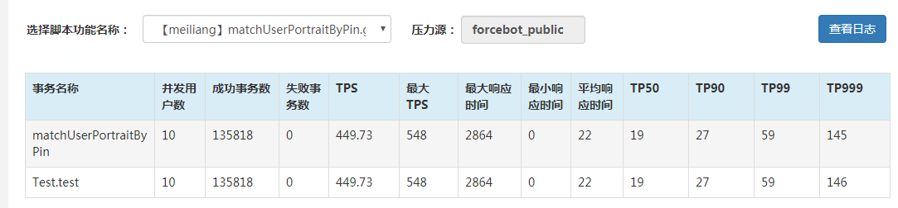
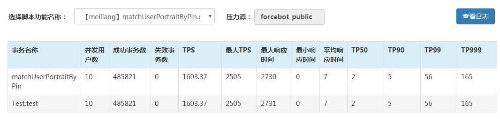
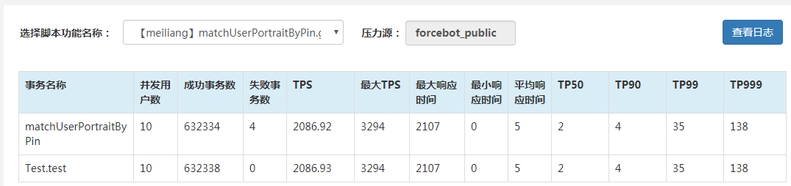

# 一次典型的性能压测试问题分析

### 1.接口逻辑   

  校验用户pin的用户画像是否匹配所配置的人群策略，方法参数，用户pin和配置人群策略

### 2.压测记录

压测数据

10个楼层，每个楼层六个人群

第一次压测   100虚拟用户 20线程 5个压侧机

第二次压测  10个虚拟用户  5个线程 2个压侧机     疑问，相同环境，100个虚拟用户和10个虚拟用户为什么性能指标相差这么多？咨询桥总后，说正常压测10个虚拟用户就够了

根据第二组压测数据，发现TP99下来了，但是TPS还是不咋的，继续分析java堆栈TOP10的数据，发现以下两个方法的耗时排前两个，所以先假定是这两个方法影响了性能，首先把方法里面涉及打error日志的地方都清除，再进行压测

> "JSF-BZ-22000-18-T-20" \#223 daemon prio=5 os\_prio=0 tid=0x00007fa3b803e800 nid=0x5eb46 runnable \[0x00007fa6248d1000\]  
> java.lang.Thread.State: RUNNABLE  
> at java.lang.Throwable.fillInStackTrace\(Native Method\)  
> at java.lang.Throwable.fillInStackTrace\(Throwable.java:783\)  
> - locked &lt;0x00000000e7606210&gt; \(a java.lang.Exception\)  
> at java.lang.Throwable.\(Throwable.java:250\)  
> at java.lang.Exception.\(Exception.java:54\)  
> at java.lang.Thread.getStackTrace\(Thread.java:1552\)  
> at com.jd.jshop.operations.common.utils.Ump.methodReg\(Ump.java:29\)  
> at com.jd.jshop.operations.jsf.service.strategy.impl.LaunchStrategyJsfServiceImpl.matchUserPortraitByPin\(LaunchStrategyJsfServiceImpl.java:210\)

> at java.util.concurrent.locks.LockSupport.park\(LockSupport.java:175\)  
> at java.util.concurrent.locks.AbstractQueuedSynchronizer.parkAndCheckInterrupt\(AbstractQueuedSynchronizer.java:836\)  
> at java.util.concurrent.locks.AbstractQueuedSynchronizer.acquireQueued\(AbstractQueuedSynchronizer.java:870\)  
> at java.util.concurrent.locks.AbstractQueuedSynchronizer.acquire\(AbstractQueuedSynchronizer.java:1199\)  
> at java.util.concurrent.locks.ReentrantLock$NonfairSync.lock\(ReentrantLock.java:209\)  
> at java.util.concurrent.locks.ReentrantLock.lock\(ReentrantLock.java:285\)  
> at ch.qos.logback.core.OutputStreamAppender.subAppend\(OutputStreamAppender.java:210\)  
> at ch.qos.logback.core.rolling.RollingFileAppender.subAppend\(RollingFileAppender.java:235\)  
> at ch.qos.logback.core.OutputStreamAppender.append\(OutputStreamAppender.java:100\)  
> at ch.qos.logback.core.UnsynchronizedAppenderBase.doAppend\(UnsynchronizedAppenderBase.java:84\)  
> at ch.qos.logback.core.spi.AppenderAttachableImpl.appendLoopOnAppenders\(AppenderAttachableImpl.java:51\)  
> at ch.qos.logback.classic.Logger.appendLoopOnAppenders\(Logger.java:270\)  
> at ch.qos.logback.classic.Logger.callAppenders\(Logger.java:257\)  
> at ch.qos.logback.classic.Logger.buildLoggingEventAndAppend\(Logger.java:421\)  
> at ch.qos.logback.classic.Logger.filterAndLog\_0\_Or3Plus\(Logger.java:383\)  
> at ch.qos.logback.classic.Logger.error\(Logger.java:522\)

第三次压测  10个虚拟用户  5个线程 2个压侧机  删除error日志    TP99没有什么变化，但是TPS上升了两倍

第四次压测  10个虚拟用户  5个线程 2个压侧机  删除UMP封装方法才用写死监控key的方式，删除error日志    TP99下降4/1，但是TPS上升了4/1，然后对比ump监控发现TP99的消耗主要在外部接口用户画像上，内部匹配代码已经没有什么优化空间了

结论：根据上面的压测分析，我们可以看到，Ump.methodReg方法里面的Thread.currentThread\(\).getStackTrace\(\)和打error日志在高并发的情况下对性能还是有一定的影响。  这里主要开发接口的时候自己为了方便排查问题，对关键数据的地方都打了error日志，这里后面要注意

参考资料：[https://stackoverflow.com/questions/2347828/how-expensive-is-thread-getstacktrace](https://stackoverflow.com/questions/2347828/how-expensive-is-thread-getstacktrace)

